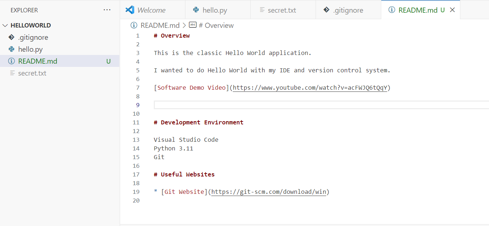

# Overview

This is the classic Hello World application.

I wanted to do Hello World with my IDE and version control system.

[Software Demo Video](https://www.youtube.com/watch?v=acFWJQ6tQqY)

# Development Environment

Visual Studio Code
Python 3.11
Git

# Useful Websites

* [Git Website](https://git-scm.com/download/win)
